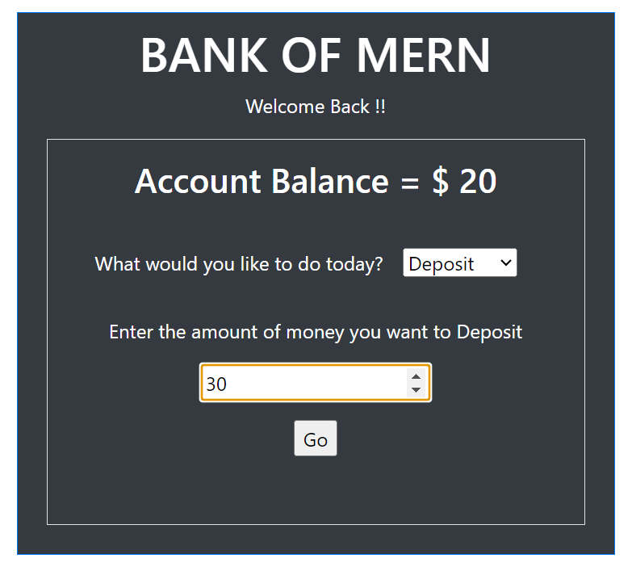

**Title:** ATM

**Description**: This is a simulation of an ATM Machine. It shows the account balance and a srop down to choose either nothing, or deposit or cash back. If Deposit or cash back is chosen, it shows an input box to enter the amount to deposit or cash back. It maintains the amount in the back and credits and debits based on the deposit or cashback transaction. If amount entered is 0 or amount for cash back is less than the total bank amount, the Go button is disabled.If the user changes deposit to cash back or vice versa and there is an amount in the input field, it blanks it out. 

**How to Run:** To run this project, put the 2 files account.jsx and standalone.html in your web server document root and open the standalone.html file in the browser 

**Roadmap of future improvements:** A login and authentication module can be added along with the connection to a database for interacting with real time data.

**License information:** MIT License

