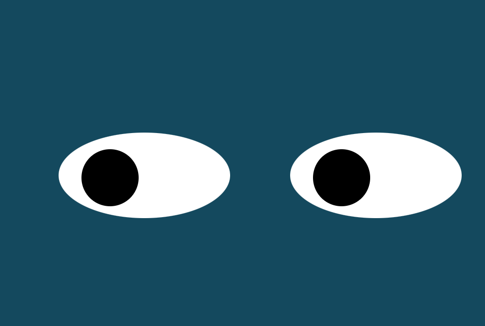

**Title**: Eye Movement

**Description**: In this project, there are a pair of eyes shown on the browser. As soon as the mouse enters the screen the eyes start following it. The eyes follow any movement of the mouse as long as it is within the scope of the browser

**How to Run:** To run this project, put the 3 files index.html, eyes.js and styles.css in your webserver host and open the index.html file in the browser 

**Roadmap of future improvements:** This could be expanded to show a mouth/ eyebrows and change the shape/ image of them depending on the direction of the eyes. 

**License information:** MIT License

