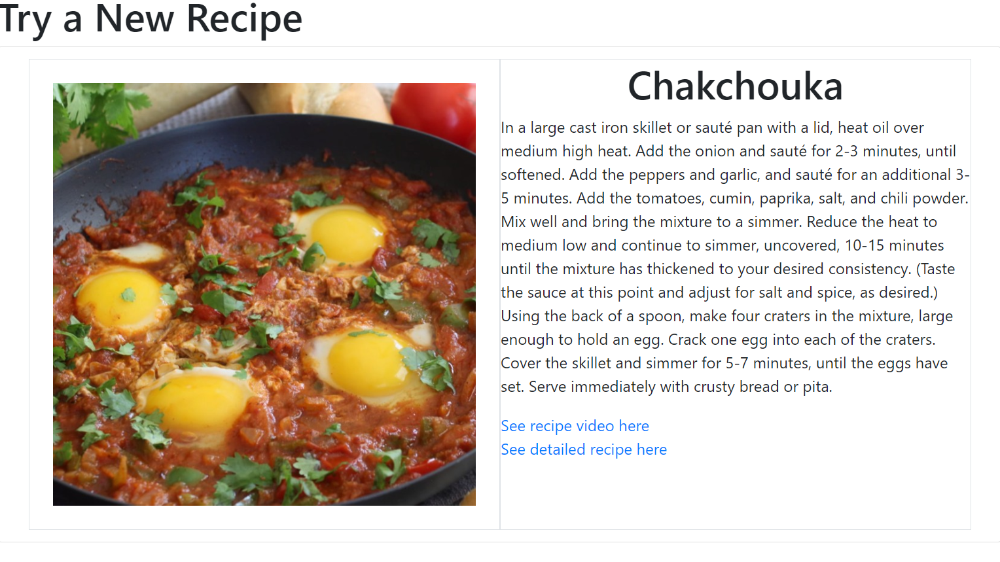

**Title:** Find a New Recipe

**Description**: This is a react project using TheMealDB API to find a random new recipe. Using the json data, retrieved the website shows a picture of the recipe, instructions and a link for the video of the recipe and a link to the detailed instructions for the recipe too.

**How to Run:** To run this project, put the 2 files findARecipe.jsx and standalone.html in your web server document root and open the standalone.html file in the browser 

**Roadmap of future improvements:** Variations to search a recipe based on the ingredients can be added and instead of refreshing a browser, a button could be provided to lookup the recipes. The video can also be embedded in the website instead of providing a link

**License information:** MIT License

