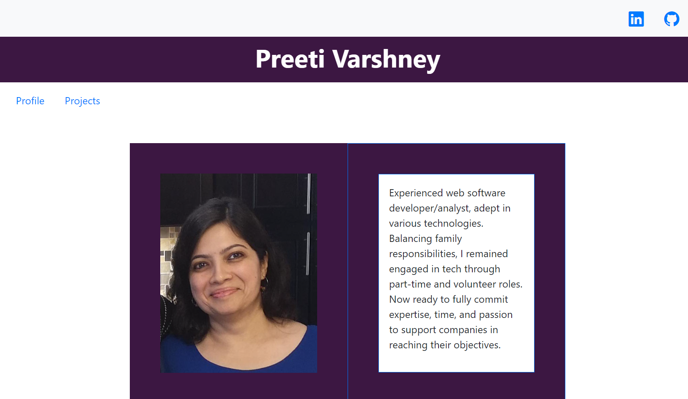

**Title:** Refactored Portfolio with React

**Description**: This is the portfolio project refactored to use React. Custom component mit-project is used to display the projects. Also the included pages nav.html, contact.html and profile.html are loaded using async calls.

**How to Run:** To run this project, put the files in your web server document root and open the index.html file in the browser 

**Roadmap of future improvements:** This can be improved to give the projects display a little character by modifying the background of alternate projects to a different color and possibly alternating left and right for the images.

**License information:** MIT License

