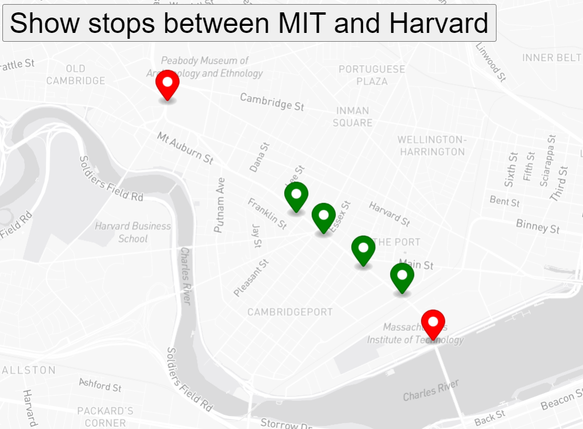

**Title**: Bus Tracker Exercise

**Description**:This excercise shows the Map of boston using the MapBox API and shows a button to track stops between MIT and Harvard. On pressing the buttons, the origin and destination are shown as red markers and in between stops are seen as green markers

**How to Run:** To run this project, put the 3 files index.html, mapanimation.js and styles.css in your webserver host and open the index.html file in the browser 

**Roadmap of future improvements:** This could be expanded to show a list of the available routes so they show all stops in between the origin and destination of any bus routes.  It could also be extended to show the real time status of a bus.

**License information:** MIT License