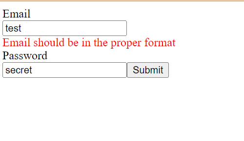

**Title:** Login Form

**Description**: This is a login screen that accepts email and password to log in. It uses Formik to make sure both the fields are not empty and if email is in the proper format. 
Once the 2 are submitted, it throws an alert saying 'Login successful' 

**How to Run:** To run this project, put all the files in a local folder. Run npm install. Then npm start at the command prompt. It will open the scrren in a browser. 

**Roadmap of future improvements:** This can be extended to check the username/ password combination against saved credentials in a database

**License information:** MIT License
