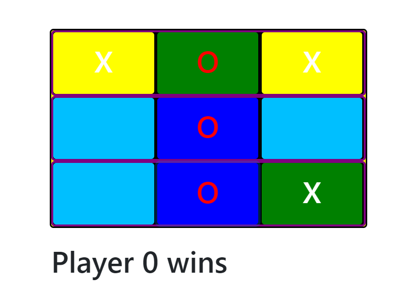

**Title:** TicTacToe

**Description**: This is a game of TicTacToe. 2 players take turns putting in their sign O or X. the person to get 3 in a row first wins.

**How to Run:** To run this project, put all the files in your web server document root and open the standalone.html file in the browser 

**Roadmap of future improvements:** 
1) Disable the game board once a player wins and add confetti to show visible win.
2) A player should not be able to overwrite any square that is already written to.
3) Add Restart button to reset the board.
4) Ability to play the computer.

**License information:** MIT License

